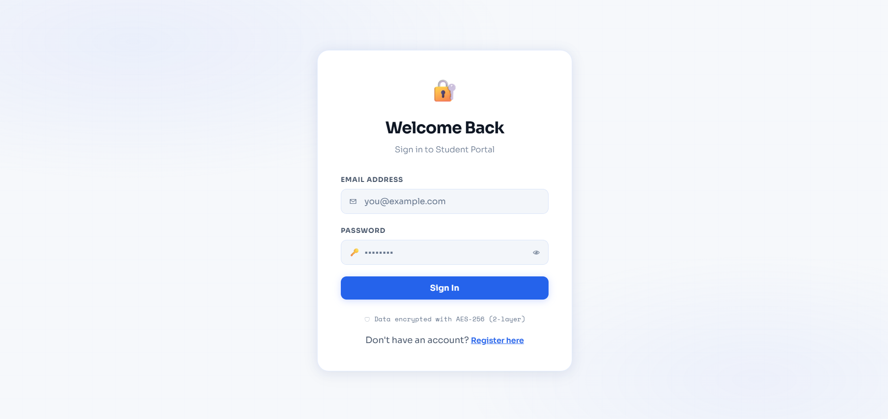
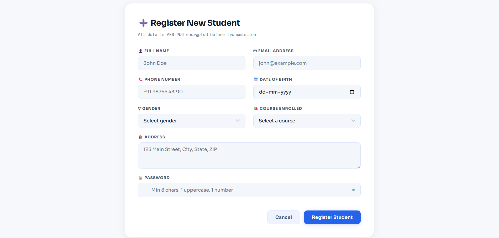
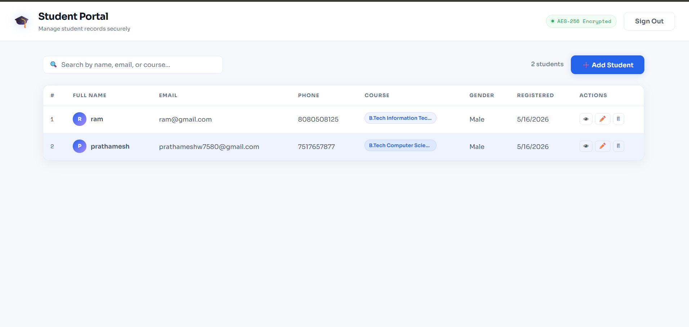
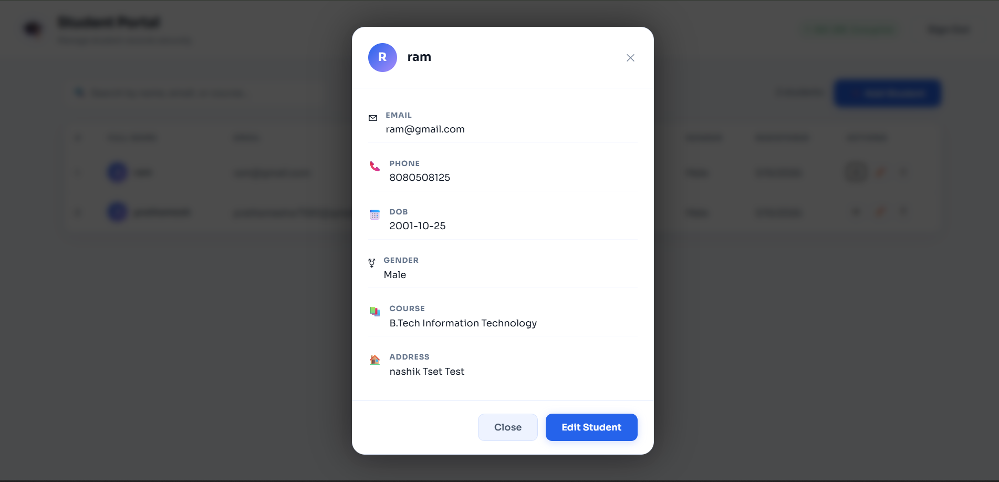
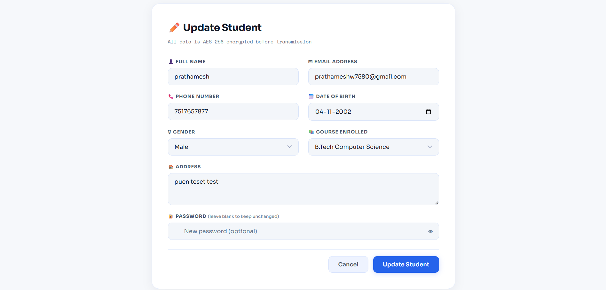

# Task React Node TypeScript

## Overview

This repository contains a full-stack student management application built with React + TypeScript on the frontend, and Node.js + Express + TypeScript on the backend. The project uses AES encryption for secure client-server communication and data storage.

## Tech Stack

- Frontend
  - React
  - TypeScript
  - Vite
  - Axios
  - crypto-js

- Backend
  - Node.js
  - Express
  - TypeScript
  - Mongoose
  - bcryptjs
  - jsonwebtoken
  - dotenv
  - helmet
  - express-rate-limit
  - crypto-js

- Database
  - MongoDB (assumed)

## Setup Instructions

### Prerequisites

- Node.js 18+ installed
- npm or Yarn installed
- MongoDB database available

### 1. Clone the repository

```bash
git clone <repo-url>
cd "e:\Node Js\task-react-node-typescript"
```

### 2. Setup the backend

```bash
cd server
npm install
```

Create a `.env` file in `server/` with values like:

```env
PORT=5000
MONGO_URI=<your-mongodb-connection-string>
BACKEND_ENCRYPTION_KEY=backend_aes_secret_key_32chars!!
FRONTEND_ENCRYPTION_KEY=frontend_aes_secret_key_32chars!
JWT_SECRET=<your-jwt-secret>
```

Start the backend in development:

```bash
npm run dev
```

Or build and run production:

```bash
npm run build
npm start
```

### 3. Setup the frontend

```bash
cd ../client
npm install
```

Create a `.env` file in `client/` with values like:

```env
VITE_FRONTEND_ENCRYPTION_KEY=frontend_aes_secret_key_32chars!
VITE_API_URL=http://localhost:5000
```

Start the frontend:

```bash
npm run dev
```

### 4. Access the app

Open the URL shown by Vite in your browser, usually:

```bash
http://localhost:5173
```

## How Encryption is Implemented

Encryption is handled in two layers to protect data on the client and in storage.

### Frontend encryption (Level 1)

- The frontend uses `crypto-js` and an AES key configured by `VITE_FRONTEND_ENCRYPTION_KEY`.
- Sensitive student fields are encrypted before sending data to the backend.
- On response, the frontend decrypts data using the same AES key.

### Backend encryption (Level 2)

- The backend uses `crypto-js` and a separate AES key from `BACKEND_ENCRYPTION_KEY`.
- When the backend receives data, it first decrypts the Level 1 payload using `FRONTEND_ENCRYPTION_KEY`.
- The backend then re-encrypts the plaintext with `BACKEND_ENCRYPTION_KEY` before storing it in MongoDB.
- When retrieving data from storage, the backend decrypts Level 2 data, then re-encrypts it with `FRONTEND_ENCRYPTION_KEY` for the frontend.

### Encryption flow summary

1. User enters student data in the frontend.
2. Frontend encrypts data using `FRONTEND_ENCRYPTION_KEY`.
3. Backend decrypts Level 1 data and re-encrypts it with `BACKEND_ENCRYPTION_KEY`.
4. Data is stored in MongoDB as encrypted Level 2 ciphertext.
5. On read, backend decrypts Level 2 data and re-encrypts with `FRONTEND_ENCRYPTION_KEY`.
6. Frontend decrypts the returned Level 1 encrypted payload.

## Project Structure

- `client/` - React frontend source code
- `server/` - Express backend source code
- `server/src/utils/crypto.ts` - encryption/decryption helpers for backend
- `client/src/utils/crypto.ts` - frontend encryption/decryption helpers

## Screenshots

Below are the available screenshot previews for the app:

- `screenshots/login.png` - login screen
- `screenshots/register.png` - registration screen
- `screenshots/dashboard.png` - student dashboard or listing page
- `screenshots/details.png` - student detail view
- `screenshots/updateStudent.png` - update student screen

### Screenshot previews











## Notes

- Keep encryption keys secret and never commit `.env` files to source control.
- Ensure the frontend and backend share the same `FRONTEND_ENCRYPTION_KEY`.
- The backend uses a separate `BACKEND_ENCRYPTION_KEY` so stored data remains encrypted even if frontend traffic is intercepted.
